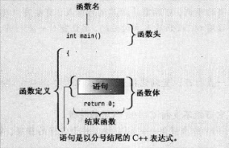

# Begin to learn C++

## I.进入C++
### 1.main函数

- 函数名:main
- 函数头:int main()
- 函数体:花括号中包括的部分
- 结束语句:作为以int为返回值的函数 需要返回语句(return statement)来结束函数
- 参数:在C++中,让括号空着与在括号中使用void等效,而在C中,让括号空着意味着对是否接收参数保持沉默
#### main函数有什么用

    main函数被启动代码(见第一章笔记)调用,而启动代码是由编译器添加到程序中的,即启动代码是程序和操作系统之间的桥梁

    而main函数即程序的入口,程序由此开始运行

#### 为什么要以main为名字作为主程序的入口

    人规定的

但在有时,比如Windows编程中编写一个DLL模块或者单片机编程时就不需要main函数

### 2.iostream文件

    #include<iostream>
`该语句将iostream文件中的内容添加到源代码中`

#### 为什么要把iostream文件中的内容添加到程序中?

    因为其涉及了程序与外部世界之间的通信:该文件中包含了C++的输入输出方案

`iostream文件的内容会取代程序中的代码行#include<iostream>。而原始文件没有被修改,只是将源代码文件和iostream组合成一个复合文件,编译的下一阶段将使用该文件`
### 3.名称空间

如果使用`iostream`,而不是iostream.h的话,则应使用下面的名称空间编译指令来使iostream中的定义对程序可用:

    using namespace std;

#### 它有什么用?

假设A,B两个产品中均有func()这个函数,则如何区分它们?

此时就可以使用`A::func()`和`B::func()`来区分不同版本

因此我们使用的cout,cin,endl 其实是std::cout,std::cin,std::endl

我们为了省事才使用的using namespace std

也就是该using编译指令使得std名称空间中的所有名称都可用

同样的我们可以指定某一个库中的指定名称可用,例如:

    using std::cout;
    using std::cin;
    using std::endl;

### 4.endl

`endl与\n有什么区别`

    endl确保程序继续运行前刷新输出(将其立即显示在屏幕上),而\n不能提供这样的保证,
    这意味着在有些系统中,有时可能在您输出信息后才会出现提示

### 5.cin 与 cout
cout与cin分别是ostream与istream类的一个对象,在其类中定义了其表示的数据以及可以对他执行的操作

### 6.函数声明/定义/调用
```cc
    #include <iostream>
    void simon(int);    // 函数声明、原型

    int main()
    {
        using namespace std;
        simon(3);       // 函数调用
        cout << "Pick an integer: ";
        int count;
        cin >> count;
        simon(count);   // 函数再次调用
        cout << "Done!" << endl;
        // cin.get();
        // cin.get();
        return 0;
    }

    void simon(int n)   // 函数定义
    {
        using namespace std;

        cout << "Simon says touch your toes " << n << " times." << endl;
    }                  
```
