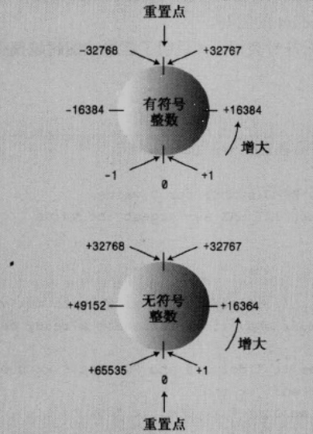
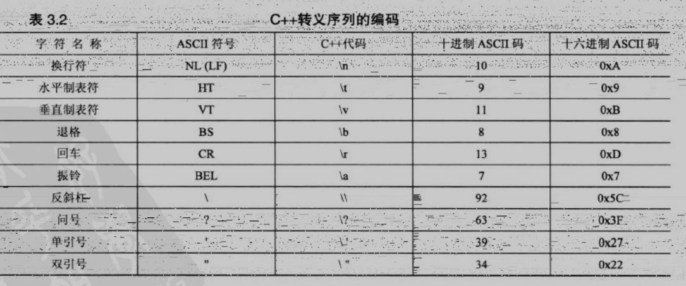
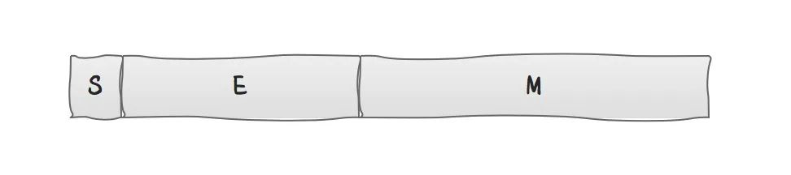
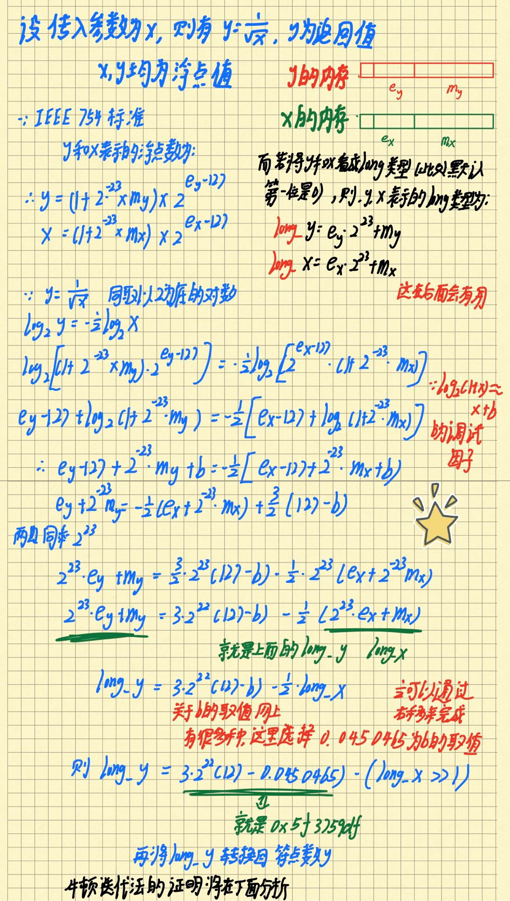
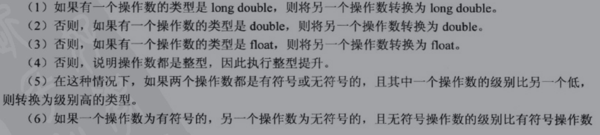
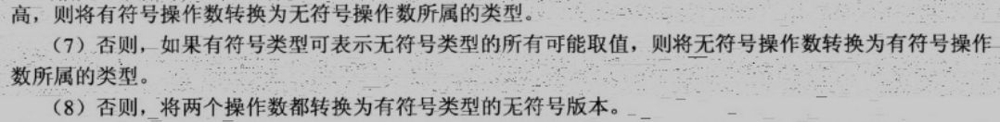

# 处理数据
## I. 变量名规则
- 只能使用字母字符,数字,和下划线(_)
- 但名称的第一个字符不能是数字
 ```c
int 4ever;  //invalid
int my_star3; //valid
```
- 大小写敏感
- 不能用C++关键字作为变量名
```c
int double; //invalid
```
- 以两个下划线打头或以下划线和大写字母打头的变量名将被保留给实现(编译器机器使用的资源)使用.以一个下划线开头的名称将被保留给实现,作为全局标识符
```c
int _Mystar3;  
int __fools;   
int _a;
```
- C++对于名称的长度没有限制,名称中所有的字符都有意义

## II. 整型 
整形分为有符号类型与无符号类型 按照存储宽度又可以分为char/short/int/long/long long五种类型,所以共计十种类型

各个类型的存储宽度不固定,根据编译器和系统的位数决定,但有一个大致的标准,即:
- short至少为16位
- int至少和short一样长
- long至少为32位,且至少与int一样长
- long long 至少64位,且至少与long一样长

### sizeof()运算符

用来检查类型的长度的函数.它可以返回类型,或变量的长度,单位为`字节`

在对某一类型名或变量名使用sizeof时需要将其放入括号中,如果是变量名加不加括号都可以

在本计算机下,通过sizeof运算符计算出来short,int,long,long long宽度的代码如下,(在不同的计算机下结果可能不同):

```c
using namespace std;
#include <iostream>
#include <climits>
int main()
{
    int n_int = INT_MAX;
    cout << "int is " << sizeof(int) << " bytes." << endl; //int is 4 bytes.
    cout << "int max: " << n_int << endl;                  //int max: 2147483647

    short n_short = SHRT_MAX;
    cout << "short is " << sizeof n_short << " bytes." << endl; //short is 2 bytes.
    //!注意sizeof不是一个函数,因为如果是函数的话上面这条语句则不成立,因为函数需要在括号里传参来调用
    cout << "short max: " << n_short << endl; //short max: 32767

    long n_long = LONG_MAX;
    cout << "long is " << sizeof(long) << " bytes." << endl; //long is 4 bytes.
    cout << "long max: " << n_long << endl;                  //long max: 2147483647

    long long n_llong = LLONG_MAX;
    cout << "long long is " << sizeof(long long) << " bytes." << endl; //long long is 8 bytes.
    cout << "long long max: " << n_llong << endl;                      //long long max: 9223372036854775807
```

### 无符号类型与有符号类型的溢出问题


```cc
#include <iostream>
#include <climits>  // defines INT_MAX as largest int value
int main()
{
    using namespace std;
    short a = SHRT_MAX;    
    unsigned short b = a;

    cout << "a is " << a << " and b is " << b << endl;  //a is 32767 and b is 32767

    cout<<"now a++ and b++"<<endl;
    a = a + 1;
    b = b + 1;
    cout << "a is " << a << " and b is  " << b << endl; //a is -32768 and b is  32768

    a = 0;
    b = 0;
    a = a - 1;
    b = b - 1;
    cout << "a is " << a << " and b is  " << b << endl; //a is -1 and b is  65535
}
```


### 整形字面值
整形字面值(常量)就是显式书写的常量

C++中有三种不同的技术方法:
- 八进制 oct

第一位是0 剩下的位数均为0~7
- 十六进制 hex

前面是0X或0x 后面是0~f/F
- 十进制 dec

```c
#include <iostream>
int main()
{
    using namespace std;
    int dec = 42;     // decimal integer literal
    int hex = 0x42;   // hexadecimal integer literal
    int oct = 042;   // octal integer literal

    cout << "dec = " << dec << " (42 in decimal)\n";   //chest = 42 (42 in decimal)
    cout << "hex = " << hex << " (0x42 in hex)\n";     //waist = 66 (0x42 in hex)
    cout << "oct = " << oct << " (042 in octal)\n";    //inseam = 34 (042 in octal)
    return 0;  
}
```
其中,默认是以十进制的方式输出字面值,但可以通过控制符oct,dec,hex改变,`他们不会在屏幕上输出任何值,而是告诉cout采取何种行为`,比如:
```cc
#include <iostream>
int main()
{
    using namespace std;
    int dec = 42;   // decimal integer literal
    int hex = 0x42; // hexadecimal integer literal
    int oct = 042;  // octal integer literal

    cout << "dec = " << dec << " (42 in decimal)\n";    //dec = 42 (42 in decimal)
    cout << std::hex;
    cout << "hex = " << hex << " (0x42 in hex)\n";     //hex = 42 (0x42 in hex)
    cout << std::oct;
    cout << "oct = " << oct << " (042 in octal)\n";    //oct = 42 (042 in octal)
    return 0;
}
```

## III. char类型
### char转义符
有一些字符不能从键盘输入,因此C++语言赋予了他们特殊的含义,他们被称为转义序列.


### 关于endl与"\n"的使用

**在输出一个字符串时,显然在字符串后接一个\n后很自然**

**而在输出一个整型时,endl会更有优势**

### 基于字符的十六进制和八进制编码来表示字符

可以使用`'\???'` 或 `'\x??'` 来表示一个字符

```cc
using namespace std;
#include <iostream>
#include <climits>
int main()
{
    char A = '\x41';  //0x41=65
    char a = '\101';  //101(oct)=65
    cout << a << ' ' << A;    //  A A
}
```

## IV. const限定符

用来表示一个量为常量

    const int Months=12;

这句语句说明Months变量为int类型,值为12,`且不可修改`

一般在用const定义常量时首字母会大写,C中的#define是全部都大写

一种错误的声明const变量方式:

    const int a;
    a=10;        //表达式必须是可修改的左值

`在声明一个常量时就要为其赋值`

### const与#define

const与#define其实实现了相同的功能.但是const更加明确:
1. const能明确指定数据类型
2. const 能使用c++的作用域规则将定义限制在特定的函数或文件中
3. const 可用于更复杂的类型(如数组或结构体)
   
## V. 浮点数

另一种浮点数表示法,E表示法:

    3.45E6  =  3.45*1000 000
    8.33E-4  =  8.33/10000
    -1.6E2  =  -1.6*100

### 浮点类型

- float
- double
- long double

浮点数的有效位数的要求:
- float至少为32位
- double至少为48位,且不少于float
- long double 至少和double一样多

通常:
    
    float为32位

    double为64位

    long double为80或96或128位

### 浮点数的精度损失

```cc
#include <iostream>
int main()
{
    using namespace std; 
    cout.setf(ios_base::fixed, ios_base::floatfield); // fixed-point
    float tub = 10.0 / 3.0;     // good to about 6 places

    double mint = 10.0 / 3.0;   // good to about 15 places
    const float million = 1.0e6;

    cout << "tub = " << tub;             //tub = 3.333333, a million tubs = 3333333.250000,
    cout << ", a million tubs = " << million * tub; 
    cout << ",\nand ten million tubs = ";      //and ten million tubs = 33333332.000000
    cout << 10 * million * tub << endl;

    cout << "mint = " << mint << " and a million mints = ";
    cout << million * mint << endl;           //mint = 3.333333 and a million mints = 3333333.333333
    // cin.get();
    return 0;
}
```

说明:

因为cout通常会删除结尾的0.例如3333333.2500000显示为3333333.25 

所以调用cout.setf()会覆盖这种行为,使其显示到小数点后六位

ios_base::fixed, ios_base::floatfield是iostream中提供的常量

### 浮点常量

书写浮点常量时,程序默认将其认为是`double`类型,如果希望常量为float类型,需要使用f或F为后缀,对于long double类型的要加l或L为后缀.

### 浮点数优缺点

浮点数可以表示整数之间的值.其次他们有缩放因子,他们可以表示的范围大得多

但是浮点运算的速度比整数运算慢,且运算精度低,从下面这段代码可以看出:

```cc
    double a = 2.2E20L;
    double b = a + 1;
    cout << b - a;   //0
```

### IEEE754


IEEE754是什么?

    IEEE二进制浮点数算术标准（IEEE 754）是20世纪80年代以来最广泛使用的浮点数运算标准，为许多CPU与浮点运算器所采用。

    这个标准定义了表示浮点数的格式（包括负零-0）与反常值（denormal number），一些特殊数值（无穷∞与非数值NaN），以及这些数值的“浮点数运算符”。 
    
    常见的四种浮点数值表示方式：单精确度（32位）、双精确度（64位）、延伸单精确度（43比特以上，很少使用）与延伸双精确度（79比特以上，通常以80位实现）。C语言的float通常是指IEEE单精确度，而double是指双精确度。


表示方法:

它的值Value可以用


$(-1)^{\texttt {sign}}\times1.{\texttt {mantissa}}\times 2^{\texttt {exponent}-127}$

来进行表示。

- 其中sign即符号位 1为负 0为正
- exponent为指数大小
- mattissa即尾数，由1 0组成,表示小数点后面的数值

**例如:**

十进制下的8.25转化为2进制就是1000.01

根据科学计数法1000.01=$1.00001\times 2^{3}$

此时sign=0   exponent=127+3=130(因为还要兼顾到负数)   mattissa=00001   

那么8.25以float形式在内存中的存储的数据即:

    0 10000010 00001000000000000000000

**再例如:**

十进制下的4.1转化为2进制就是100.0001100110011001100110011.....  

`而此时因为只能存储23位,所以后面的一堆0011就会被截断,也就导致了精度损失`

根据科学计数法100.0001100110011001100110011=$1.000001100110011001100110011...\times 2^{2}$

此时sign=0   exponent=127+2=129(因为还要兼顾到负数) 

mattissa=00000110011001100110011  `此时mattissa内储存的已经是不精确的数值了` 

那么8.25以float形式在内存中的存储的数据即:

    0 10000001 00000110011001100110011
    
更多详见[IEEE 754维基网页](https://zh.wikipedia.org/wiki/IEEE_754)

### extensions:神奇的平方根倒数算法 from Quake-III Arena

在c++中完全可以用1/sqrt(num)来算出一个数的平方根倒数

但在需要大计算量的游戏领域,用上述方法求解很慢

下面的方法会比普通的方法快3~4倍
```cc
float Q_rsqrt(float number)
{
    long i;
    float x2, y;
    const float threehalfs = 1.5F;

    x2 = number * 0.5F;
    y = number;
    i = *(long *)&y;           // evil floating point bit level hacking
    i = 0x5f3759df - (i >> 1); // what the fuck?
    y = *(float *)&i;
    y = y * (threehalfs - (x2 * y * y)); // 1st iteration
    // y = y * ( threehalfs - ( x2 * y * y ) ); // 2nd iteration, this can be removed

#ifndef Q3_VM
#ifdef __linux__
    assert(!isnan(y)); // bk010122 - FPE?
#endif
#endif
    return y;
}
```


其证明过程如下:


### 牛顿迭代法
再求多次项方程的根时,往往没有解析解,只有数值解,这时借助计算机并使用牛顿迭代法将会是个不错的方式

[简易的原理](https://blog.csdn.net/ccnt_2012/article/details/81837154)

公式:$x_{n+1}=x_{n}-{\frac {f(x_{n})}{f'(x_{n})}}$

雷神之锤中最后一步用Newton Iteration 的优化原理:

已知:此时y是$1/\sqrt[]{x}$的近似值,目标为找到`关于y`的方程$\frac{1}{y^2}-x=0$的精确解

所以设函数:

$f(y)=\frac{1}{y^{2}}-x$  **此时x为常数**

$f^{\prime}(y)=-\frac{2}{y^{3}}$

$y_{\text {n+1 }}=y-\frac{f(y)}{f^{\prime}(y)}=y-\frac{\frac{1}{y^{2}}-x}{-\frac{2}{y^{3}}}=y*[\frac{3}{2}-(\frac{x}{2}*y*y)]$

即
```c
    y = y * (threehalfs - (x2 * y * y));
    //woc他简直是个天才
```
证毕


## VI. 算数运算符

### 除法分支

除法运算符的行为取决于操作数的类型
- 如果两个操作数都是整数  则会执行整数除法 这意味着结果的小数部分将被丢弃  得到的结果是一个整数
- 如果其中有一个(或两个都是)浮点数,则小数部分会保留,结果为浮点数

```cc
#include <iostream>
int main()
{
    using namespace std;
    cout.setf(ios_base::fixed, ios_base::floatfield);
    cout << "Integer division: 9/5 = " << 9 / 5 << endl;
    cout << "Floating-point division: 9.0/5.0 = ";
    cout << 9.0 / 5.0 << endl;
    cout << "Mixed division: 9.0/5 = " << 9.0 / 5 << endl;
    cout << "double constants: 1e7/9.0 = ";
    cout << 1.e7 / 9.0 << endl;
    cout << "float constants: 1e7f/9.0f = ";
    cout << 1.e7f / 9.0f << endl;
    // cin.get();
    return 0;
}

Integer division: 9/5 = 1
Floating-point division: 9.0/5.0 = 1.800000
Mixed division: 9.0/5 = 1.800000
double constants: 1e7/9.0 = 1111111.111111
float constants: 1e7f/9.0f = 1111111.125000
```

在不同类型数据进行运算时,C++将他们全部转换为同一类型.之后将会介绍这种自动转换

最后两行的相对精度表明,如果两个操作数都是double类型,则结果也为double类型；如果两个操作数都是float类型,则结果也是float类型

`浮点常量在默认情况下都是double类型`

### 如何将两个整型变量相处的结果变为浮点型

    int a=20;
    int b=7;
    double c = (double)a / b;


## VII. 类型转换

C++会在以下三种情况下执行类型转换:
- 将一种算术类型的值赋给另一种算术类型的变量
- 表达式中包含不同类型的类型
- 将参数传递给函数时

### 潜在的数值转换问题

- 将较大的浮点类型转换为较小的浮点类型(如:double==>float)时

有效数位降低,只可能超出目标类型的取值范围,在这种情况下结果是不确定的

- 将浮点类型转换为整型时

小数部分丢失,原来的值可能超出目标类型的取值范围,在这种情况下结果是不确定的

- 将较大的整型转化为较小的整型(long==>short)

原来的值可能超出目标类型的取值范围，只复制右边的字节


### 类型转换的原则

就高不就低,总是向着高精度的数据类型方向转换



