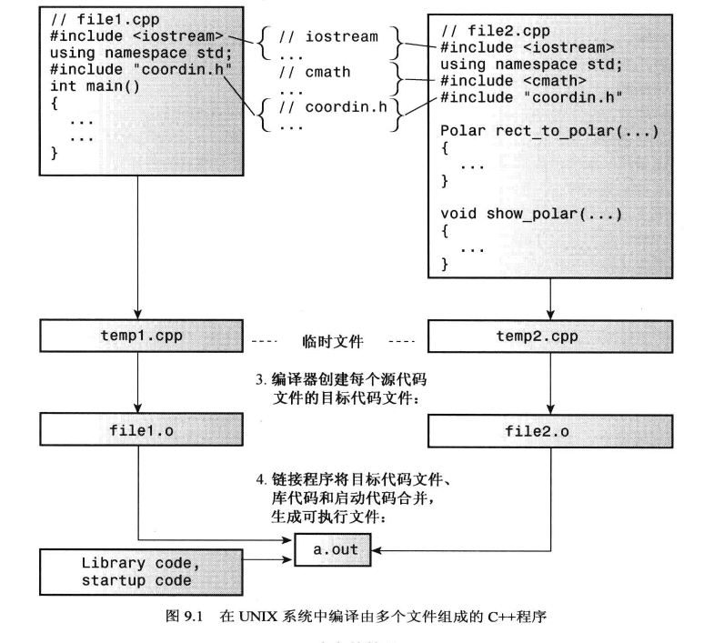

# 内存模型和名称空间
## 单独编译
将程序划分为2部分:
- 头文件:包含结构声明和使用这些结构的函数的原型

头文件中应该包含:
- - 函数原型
- - 使用#define和const定义的常量变量
- - 结构声明
- - 类声明
- - 模板声明
- - 内联函数
- 源代码文件:包含与结构有关的函数的代码(对函数进行定义的文件)
- 源代码文件:包含调用与结构相关的函数的代码(实现具体功能的文件,常常有main()函数)


头文件coordin.h实例:
```h
#ifndef __COORDIN_H_
#define __COORDIN_H_
struct polar
{
    double distance;
    double angle;
};
struct rect
{
    double x;
    double y;
};

polar rect_to_polar(rect xypos);
void show_polar(polar dapos);

#endif
```
下面的三段代码:

    #ifndef __COORDIN_H_
    #define __COORDIN_H_
    #endif
`防止多个文件多次定义同一个函数或结构体被多次声明`

函数定义文件实例:
```cpp
#include <iostream> //加尖括号是在系统目录中找
#include <cmath>
#include "coordin.h" //加双引号是在当前工程目录中找

using namespace std;

polar rect_to_polar(rect xypos)
{
    polar answer;

    answer.distance = sqrt(pow(xypos.x, 2) + pow(xypos.y, 2));
    answer.angle = atan2(xypos.y, xypos.x);
    return answer;
}

void show_polar(polar dapos)
{
    const double Rad_to_deg = 57.29577951;

    cout << "Distance = " << dapos.distance << endl;
    cout << "Angle = " << dapos.angle * Rad_to_deg << " degree" << endl;
}
```

`要记得调用自己编写的头文件`

函数调用文件示例:
```cc
#include <iostream> //加尖括号是在系统目录中找
#include <cmath>
#include "coordin.h" //加双引号是在当前工程目录中找
using namespace std;
int main()
{
    rect rplace;
    polar pplace;

    cout << "Enter the x and y values ";

    while (cin >> rplace.x >> rplace.y)
    {
        pplace = rect_to_polar(rplace);
        show_polar(pplace);
        cout << "Next two number (q to quit)";
    }
}
```
如何链接并运行:

    命令行中输入g++ file1.cpp file2.cpp  //前后无所谓
    生成了a.exe文件
    输入./a.exe就可以执行了

虽然在该文件中没有定义rect_to_polar()和show_polar()但是将file1.cpp 和 file2.cpp编译过后就可以链接在一起

## II.存储持续性、作用域和链接性
### 1.存储持续性

C++使用三种(C++11中是四种)不同的方案来存储数据,这些方案的区别就在于数据保留在内存中的时间:
1. 自动存储:

在函数定义中声明的变量(包括函数参数)的存储持续性为`自动`的,它们在程序开始执行其所属的函数或代码块时被创建,`在执行完函数或代码块时,它们使用的内存被释放`。

2. 静态存储:

在`函数定义外定义的变量`(全局变量)和`使用关键字static定义的变量`的存储持续性都为静态。它们在程序`整个运行过程中都存在`。C++有3种存储持续性为静态的变量。

3. 动态存储:

用`new运算符分配的内存将一直存在`,`直到使用 delete运算符将其释放或程序结束为止`。这种内存的存储持续性为动态,有时被称为自由存储( free store)或堆(heap)。

4. 线程存储:

当前,多核处理器很常见,这些CPU可同时处理多个执行任务。这让程序能够将计算放在可并行处理的不同线程中。如果变量是使用`关键字thread local声明的`,则其`生命周期与所属的线程一样长`。本书不探讨并行编程。